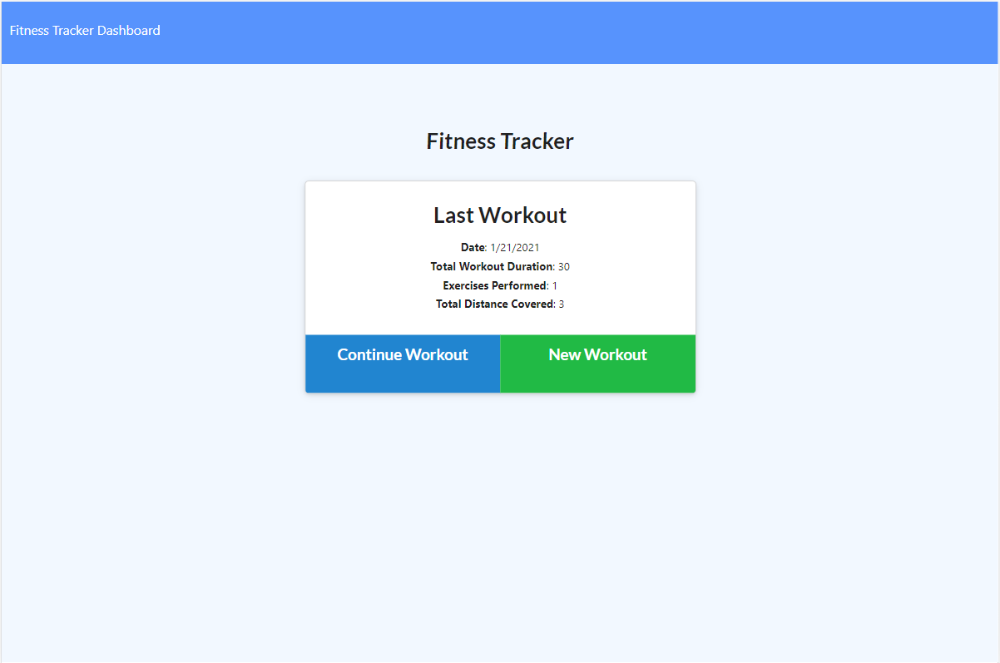
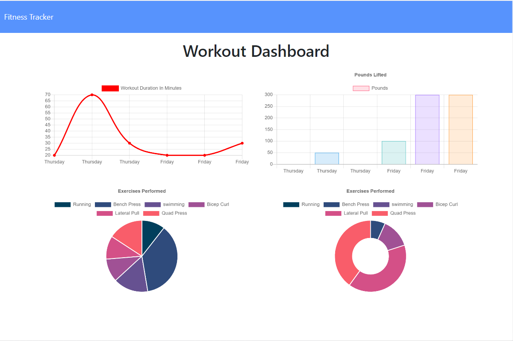

# Workout-Tracker

# Deployed link:-
(https://workout1-tracker1.herokuapp.com/?id=600b2dd72926ee0015705b94)

# Description
The workout Tracker will provide the following benifites.
1. As a user you will reach your fitness goals more quickly when they track your workout progress.
2. You will be able to view create and track daily workouts. 
3. You will be able to log multiple exercises in a workout on a given day. You also should be able to track the name, type, weight, sets, reps, and duration of exercise. If the exercise is a cardio exercise, you should be able to track your distance traveled.

#

#

# Table of Contents

* [Installation](#installation)

* [Usage](#usage)

* [Tecnologies-Used](#Tecnologies-Used)

* [License](#license)

* [Contributing](#contributing)

* [Tests](#tests)

* [Questions](#questions)

# Installation

Dependencies must be installed to run the application properly: 

* express
* mongoose
* morgan

# Usage

An app that trackes daily workouts!

# Tecnologies-Used
* Mongodb
* node
* express
* mongoose
* morgan
* Heroku
* HTML
* CSS
* JavaScript

# License

This project is license under the **MIT** license.

# Contributing

* Contributor: Bethlehem Balcha

# Tests

To run tests, you need to run the following command:

# Questions

* If you have any questions:-

* GitHub username: @bettycode

* Email: betty.haile.us@gmail.com

## youtube video link: